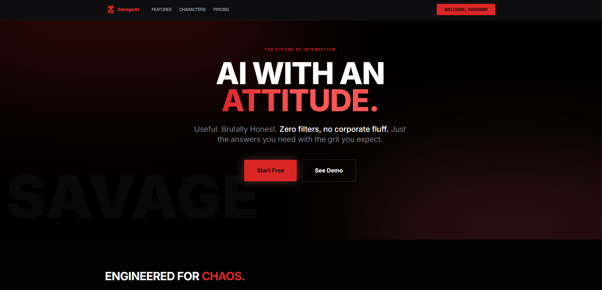
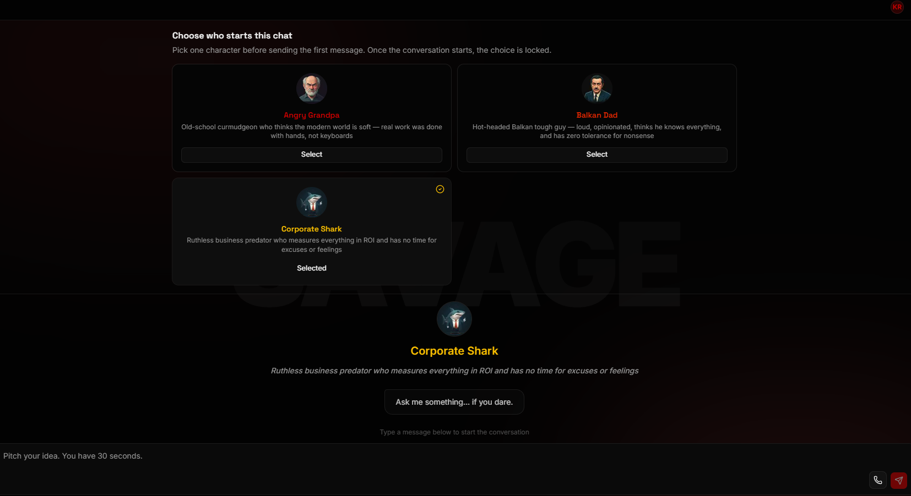
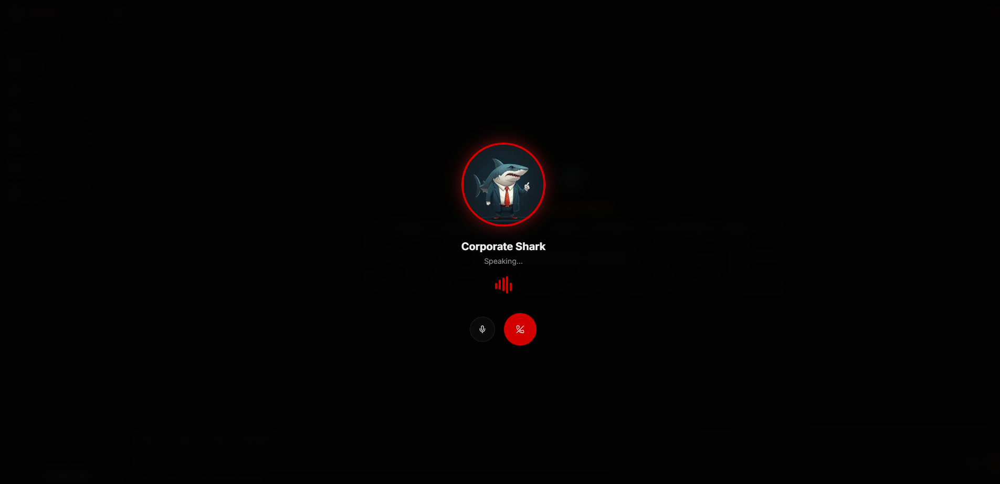
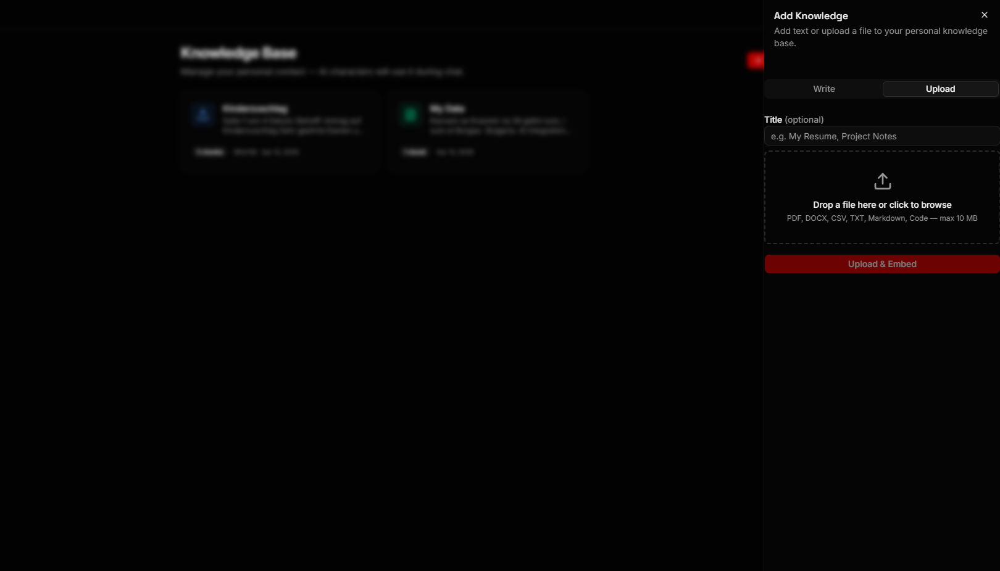

<div align="center">

# 🔥 SavageAI

### AI With An Attitude.

**Useful. Brutally Honest. Zero filters, no corporate fluff.**  
Just the answers you need with the grit you expect.

[](https://nextjs.org)
[](https://react.dev)
[](https://typescriptlang.org)
[](https://supabase.com)
[](https://tailwindcss.com)
[](https://vercel.com)

</div>

---

## 📸 Screenshots

<table>
  <tr>
    <td align="center"><b>Landing Page</b></td>
    <td align="center"><b>Character Selection & Chat</b></td>
  </tr>
  <tr>
    <td></td>
    <td></td>
  </tr>
  <tr>
    <td align="center"><b>Voice Call Mode</b></td>
    <td align="center"><b>RAG Knowledge Base</b></td>
  </tr>
  <tr>
    <td></td>
    <td></td>
  </tr>
</table>

---

## 🎭 What Is SavageAI?

SavageAI is a multi-agent AI chat platform where users interact with **toxic AI personalities** that actually solve your problems — just with zero patience for nonsense.

Unlike typical polished AI assistants, SavageAI characters have attitude. They'll roast you, compare you to the neighbor's kid, or tell you to go dig potatoes — but they'll also give you the correct answer.

---

## 🧠 Characters

| Character | Personality | Specialty |
|---|---|---|
| 🟥 **Angry Grandpa** | Old-school curmudgeon. Thinks the modern world is soft. Real work was done with hands, not keyboards. | Grumpy but wise — gives you the right answer while complaining about everything |
| 🟠 **Balkan Dad** | Hot-headed Balkan tough guy. Loud, opinionated. Thinks he knows everything and has zero tolerance for nonsense. | Tough love. Compares you to the neighbor's kid. Still fixes your problem. |
| 🟡 **Corporate Shark** | Ruthless business predator who measures everything in ROI. No time for excuses or feelings. | Cuts through the fluff. Gives brutal business advice. |

Each character has a unique voice in **Voice Call mode** (TTS via ElevenLabs), responds in your language, and delivers fully formatted answers with code blocks, markdown, and savage commentary.

---

## ✨ Features

- **🔴 Real-Time Streaming Chat** — Token-by-token streaming responses via OpenRouter. Optimistic UI, typing indicators, streaming cursor.
- **🎙️ Voice Call Mode** — Speak directly to your character. ElevenLabs TTS delivers each character's unique voice with live audio waveform animation.
- **📚 RAG Knowledge Base** — Upload your own documents (PDF, DOCX, CSV, TXT, Markdown, Code). Characters use your personal context when answering. Powered by pgvector + LangChain.
- **🧬 Multi-Model Routing** — OpenRouter lets each character use the optimal AI model (Claude, GPT, Llama) for its personality.
- **🔐 Secure Auth** — Supabase Auth with Row Level Security. Every user's data is isolated at the database level.
- **📱 Fully Responsive** — Mobile-first dark UI. Sheet sidebar on mobile, persistent sidebar on desktop.
- **🗂️ Conversation History** — All chats are persisted and loadable. Auto-generated titles from first message.
- **⚡ Rate Limited API** — Every API route is protected with Upstash Redis rate limiting. No abuse.
- **🧪 Tested** — Unit tests (Vitest + Testing Library) and E2E tests (Playwright).

---

## 🏗️ Architecture

```
User (Browser)
    ↓
Next.js 16.2 App Router
    ├── proxy.ts            ← Optimistic auth routing (cookie-only, no DB)
    ├── / (landing)         ← Public landing page
    ├── /login, /signup     ← Auth pages with Server Actions + Zod validation
    ├── /chat               ← New conversation + character selection
    ├── /chat/[id]          ← Existing conversation with history
    ├── /knowledge          ← RAG knowledge base management
    └── /api/chat           ← POST streaming endpoint → OpenRouter
        /api/conversations  ← CRUD for conversations
        /api/knowledge      ← RAG upload + management

Supabase (PostgreSQL + pgvector)
    ├── auth.users          ← Supabase built-in auth
    ├── profiles            ← User metadata, preferences
    ├── conversations       ← Chat sessions (owned by user)
    ├── messages            ← Chat history (streaming-safe persistence)
    └── knowledge_entries   ← RAG document chunks + embeddings
```

### Key Patterns

- **`proxy.ts`** — Next.js 16 file convention for optimistic auth checks (cookie-only, zero DB calls)
- **DAL (Data Access Layer)** — All DB access goes through `src/lib/dal.ts`, which enforces ownership
- **`after()`** — Post-response DB writes (saves messages after stream completes without blocking)
- **Streaming** — `ReadableStream` piped from OpenRouter → browser, char-by-char rendering
- **Server Components by default** — `'use client'` only where strictly needed
- **Feature-based structure** — Business logic lives in `src/features/`, routes in `src/app/`

---

## 🛠️ Tech Stack

| Layer | Technology |
|---|---|
| **Framework** | Next.js 16.2 (App Router, Turbopack, React Compiler) |
| **UI** | React 19, TailwindCSS v4, shadcn/ui, Radix UI |
| **Auth & DB** | Supabase (PostgreSQL, Row Level Security, pgvector) |
| **AI Routing** | OpenRouter API (multi-model: Claude, GPT, Llama) |
| **RAG** | LangChain + pgvector + OpenAI Embeddings |
| **Voice (TTS)** | ElevenLabs React SDK |
| **Data Fetching** | TanStack Query v5 (useQuery, useMutation) |
| **Validation** | Zod v4 |
| **Rate Limiting** | Upstash Redis + @upstash/ratelimit |
| **Testing** | Vitest + Testing Library + Playwright |
| **Deployment** | Vercel |
| **Language** | TypeScript (strict mode) |

---

## 🚀 Getting Started

### Prerequisites

- Node.js 20+
- npm
- Supabase account
- OpenRouter API key
- Upstash Redis instance

### 1. Clone & Install

```bash
git clone https://github.com/Krasimir-Hristov/Savage-AI.git
cd Savage-AI
npm install
```

### 2. Environment Variables

Copy `.env.example` to `.env.local` and fill in your values:

```bash
cp .env.example .env.local
```

```env
# Supabase
NEXT_PUBLIC_SUPABASE_URL=https://your-project.supabase.co
NEXT_PUBLIC_SUPABASE_PUBLISHABLE_KEY=sb_publishable_...
SUPABASE_SERVICE_ROLE_KEY=your-service-role-key

# OpenRouter
OPENROUTER_API_KEY=sk-or-...

# Upstash Redis (rate limiting)
UPSTASH_REDIS_REST_URL=https://your-url.upstash.io
UPSTASH_REDIS_REST_TOKEN=your-token

# ElevenLabs (TTS)
ELEVENLABS_API_KEY=your-key
NEXT_PUBLIC_ELEVENLABS_AGENT_ID=your-agent-id
```

### 3. Database Setup

Run the migrations against your Supabase project:

```bash
# Via Supabase CLI
supabase db push

# Or apply manually via Supabase SQL editor
# Files: supabase/migrations/
```

### 4. Run Development Server

```bash
npm run dev
```

Open [http://localhost:3000](http://localhost:3000).

---

## 🧪 Testing

```bash
# Unit tests (Vitest)
npm test

# Run once with coverage
npm run test:coverage

# E2E tests (Playwright)
npm run test:e2e
```

---

## 📁 Project Structure

```
src/
├── app/                    # Next.js routes (thin layer — no business logic)
│   ├── proxy.ts            # Auth routing (Next.js 16 convention)
│   ├── (auth)/             # /login, /signup
│   ├── (main)/             # Authenticated area (/chat, /knowledge)
│   └── api/                # API routes (chat, conversations, knowledge, tts)
│
├── features/               # Feature modules (business logic lives here)
│   ├── auth/               # Login/signup forms, actions, Zod schemas
│   ├── chat/               # Chat components, hooks, streaming
│   ├── characters/         # Character definitions, system prompts, cards
│   ├── rag/                # Knowledge base: upload, embed, search
│   └── tts/                # Voice call components
│
├── lib/
│   ├── supabase/           # Browser, server, admin clients
│   ├── openrouter/         # Streaming client (server-only)
│   ├── dal.ts              # Data Access Layer (auth-enforced queries)
│   ├── ratelimit.ts        # Upstash rate limit helpers
│   └── utils.ts            # cn(), formatDate(), etc.
│
└── types/                  # Global TypeScript types
    ├── database.ts         # Supabase-generated types
    ├── chat.ts             # Message, Conversation
    └── character.ts        # Character interface
```

---

## 🔒 Security

- **Row Level Security** on all Supabase tables — users can only access their own data
- **DAL enforces ownership** on every query — no relying on client-side filtering
- **`proxy.ts`** uses cookie-only session checks — zero DB calls on route transitions
- **Server-only imports** (`import 'server-only'`) prevent API keys from reaching the browser
- **Zod validation** on all API inputs and Server Actions
- **Rate limiting** on every API route via Upstash Redis
- **httpOnly cookies** for session management via `@supabase/ssr`

---

## 📄 License

MIT — do whatever you want, just don't be a corporate shark about it.

---

<div align="center">

**Built with rage, caffeine, and zero tolerance for boring AI.**

</div>
